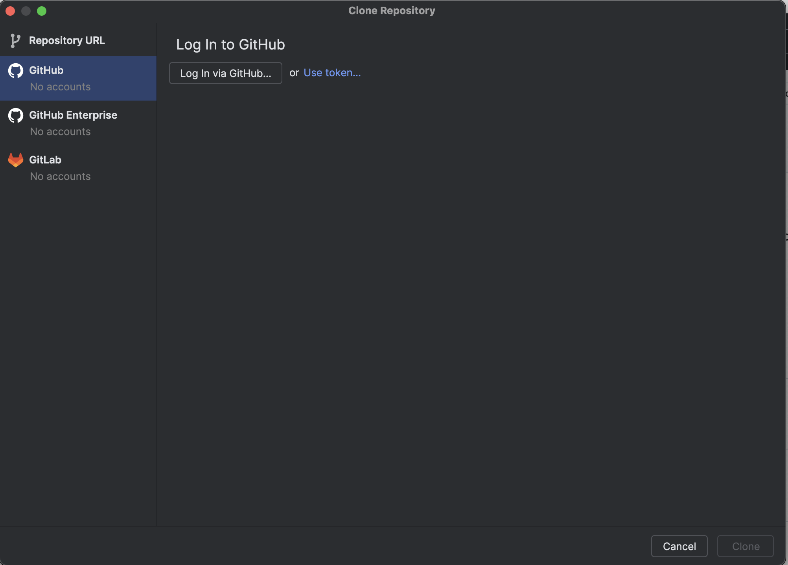
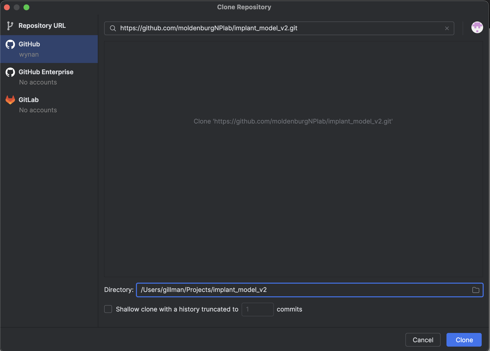
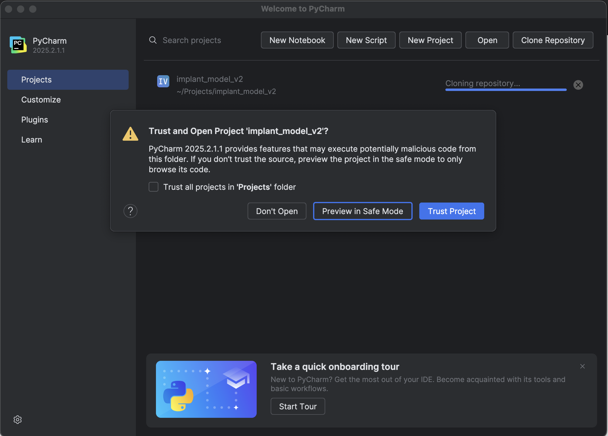
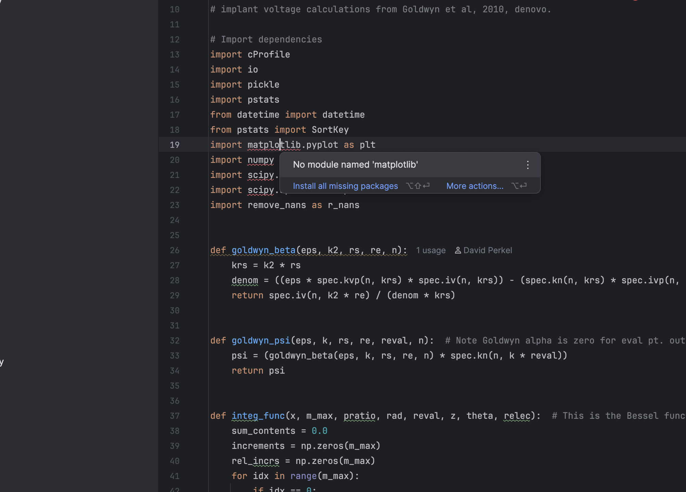
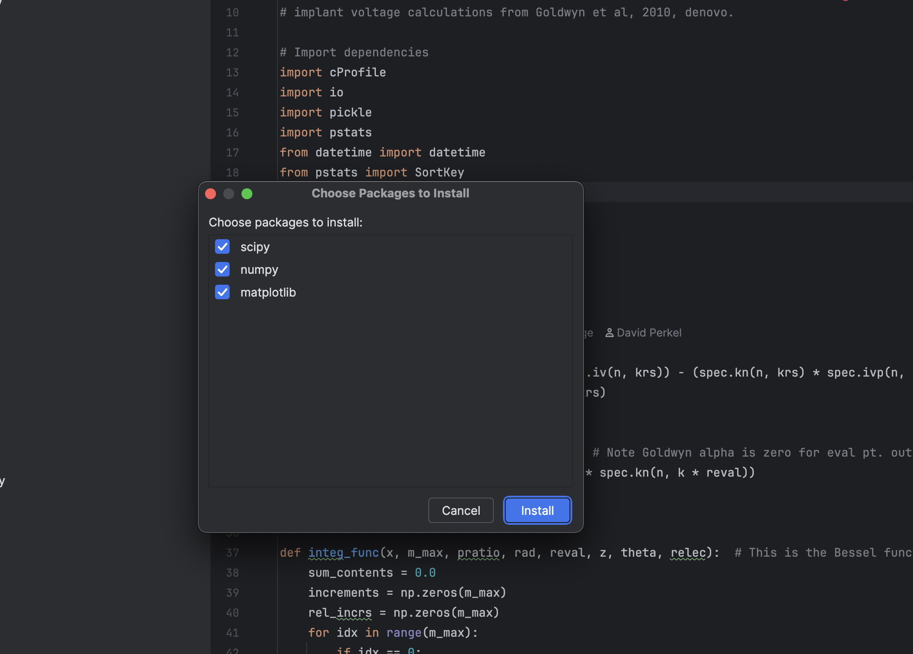
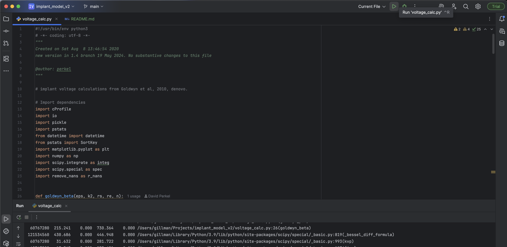

# Implant Model V2
Model of a cochlea with cochlear implant.

## Getting Started
1. Download, install and open PyCharm Community Edition: https://www.jetbrains.com/pycharm/
2. Click on the "Clone Repository" to download it to your local computer. 
3. Log into GitHub so you can download the files. 
4. Select repository and location to download too. 
5. If it asks you to trust the project select Yes. 
6. Open the voltage_calc.py file.
7. Add python modules to the Project by mousing over the red squiggles and clicking "Install All Missing Modules". 
8. If an alert pops up warning about the install, select the global option.
9. Make sure all modules are selected and click the "Install" button. 
10. Open voltage_calc.py. This script precalculates the table of voltages and activation functions used by the rest of the model. 
11. To create a voltage table, edit voltage_calc.py. Main parameters to review/edit: radius, res_int, res_ext, zEval, output_filename. 
12. To run the script make sure the file is selected and click the green play button in the upper right corner. 
13. Running this script will probably take overnight, depending on the machine. 
14. Alternatively, use the sample voltage table provided in the repository: ‘SampleVoltageTable.npy’ 
15. Run the forward model. Open FwdModel4.py. Then edit common_params.py to set the specific scenario(s) to run. If you want to create a new scenario, you’ll need to edit set_scenarios.py. 
16. Before running the inverse model it's critical to run the 2-dimensional forward model: FwdModel4_2D.py. 
17. Run the inverse model. Add a run configuration to the Project to run InverseModelCombineds.py. Run the file. While it is running you will see the average threshold error in dB scroll in the console.